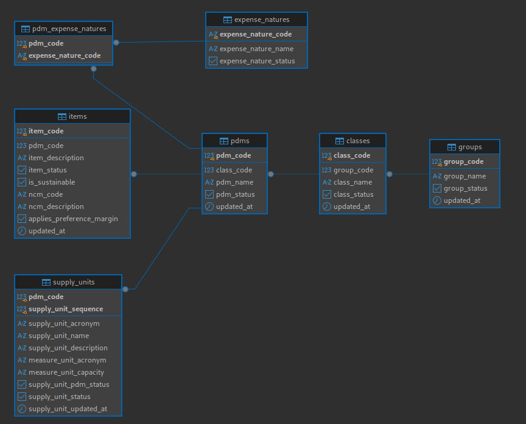

# Projeto para busca de catmat/catserv

Esse projeto foi construído para buscar de forma automatizada os catmat/catserv com base no descritivo do material e serviço definido pelo usuário. Sem esse projeto as buscas eram feitas de forma manual, o que demandava muito tempo e esforço. Com a automatização, é possível realizar buscas mais rápidas e precisas, economizando tempo e recursos no processo de licitação além de poder ser integrado a outros sistemas de forma simples.

## Entendendo como funciona a organização dos catmats

O comprasnet utiliza o conceito de PDM - Padrão Descritivo de Materiais, que é uma forma de padronizar a descrição dos materiais e serviços, facilitando a busca e a identificação dos mesmos. O PDM ecnontra-se agrupado em grupos e classes. Nas subseções abaixo, vamos detalhar cada um desses elementos e como eles se relacionam.

### Grupos

Os grupos são a primeira camada do PDM e representam uma categoria ampla de materiais ou serviços. Cada grupo possui os seguintes atributos:

| Nome do Campo | Descrição |
| --- | --- |
| **codigoGrupo** | Um identificador único para o grupo. |
| **nomeGrupo** | Nome do grupo. |
| **statusGrupo** | Situação do grupo (ativo ou inativo). |
| **dataHoraAtualizacao** | Data e hora em que o grupo foi atualizado. |

Para fazer a busca de grupos podemos usar a URI `https://dadosabertos.compras.gov.br/modulo-material/1_consultarGrupoMaterial` da API do comprasnet, que retorna uma lista de grupos disponíveis.

### Classes

As classes são a segunda camada do PDM e representam uma subcategoria dentro de um grupo. Cada classe possui os seguintes atributos:

| Nome do Campo | Descrição |
| --- | --- |
| **codigoClasse** | Um identificador único para a classe. |
| **codigoGrupo** | O código do grupo ao qual a classe pertence. |
| **nomeGrupo** | Nome do grupo. |
| **nomeClasse** | Nome da classe. |
| **statusClasse** | Situação da classe (ativo ou inativo). |
| **dataHoraAtualizacao** | Data e hora em que a classe foi atualizada. |

Para fazer a busca de classes podemos usar a URI `https://dadosabertos.compras.gov.br/modulo-material/2_consultarClasseMaterial` da API do comprasnet, que retorna uma lista de classes disponíveis.

### PDMs

Os PDMs são um conjunto de regras, características e valores usado para organizar e padronizar o cadastro de itens e produtos.

| Nome do Campo | Descrição |
| --- | --- |
| **codigoGrupo** | Código do grupo. |
| **nomeGrupo** | Nome do grupo. |
| **codigoClasse** | Código da classe. |
| **nomeClasse** | Nome da classe. |
| **codigoPdm** | Código do PDM. |
| **nomePdm** | Nome do PDM. |
| **statusPdm** | Situação do PDM (ativo ou inativo). |
| **dataHoraAtualizacao** | Data e hora em que o PDM foi atualizado. |

Para fazer a busca de PDMs podemos usar a URI `https://dadosabertos.compras.gov.br/modulo-material/3_consultarPdmMaterial` da API do comprasnet, que retorna uma lista de PDMs disponíveis.

### Catmats

Os catmats são a camada final do PDM e representam os materiais cadastrados no sistema. Cada catmat possui os seguintes atributos:

| Nome do Campo | Descrição |
| --- | --- |
| **codigoItem** | Um identificador único para o catmat. |
| **codigoGrupo** | Código do grupo ao qual o catmat pertence. |
| **nomeGrupo** | Nome do grupo. |
| **codigoClasse** | Código da classe ao qual o catmat pertence. |
| **nomeClasse** | Nome da classe. |
| **codigoPdm** | Código do PDM ao qual o catmat pertence. |
| **nomePdm** | Nome do PDM. |
| **descricaoItem** | Descrição detalhada do catmat. |
| **statusItem** | Situação do catmat (ativo ou inativo). |
| **itemSustentavel** | Indica se o catmat é sustentável ou não. |
| **codigo_ncm** | Código de NCM - Nomenclatura Comum do Mercosul. |
| **descricao_ncm** | Descrição do NCM. |
| **aplica_margem_preferencia** | Indica se o catmat aplica margem de preferência ou não. |
| **dataHoraAtualizacao** | Data e hora em que o catmat foi atualizado. |

Para fazer a busca de catmats podemos usar a URI `https://dadosabertos.compras.gov.br/modulo-material/4_consultarItemMaterial` da API do comprasnet, que retorna uma lista de catmats disponíveis.

### Natureza de despesa

A natureza de despesa é um código que identifica a categoria de gasto associada a um PDM. Cada natureza de despesa possui os seguintes atributos:

| Nome do Campo | Descrição |
| --- | --- |
| **codigoPdm** | Código do PDM ao qual a natureza de despesa pertence. |
| **codigoNaturezaDespesa** | Código único da natureza de despesa. |
| **nomeNaturezaDespesa** | Nome da natureza de despesa. |
| **statusNaturezaDespesa** | Situação da natureza de despesa (ativo ou inativo). |

Para fazer a busca de natureza de despesa podemos usar a URI `https://dadosabertos.compras.gov.br/modulo-material/5_consultarMaterialNaturezaDespesa` da API do comprasnet, que retorna uma lista de naturezas de despesa disponíveis.

### Unidade de Fornecimento

A unidade de fornecimento é um código que identifica a unidade de medida associada a um PDM. Cada unidade de fornecimento possui os seguintes atributos:

| Nome do Campo | Descrição |
| --- | --- |
| **codigoPdm** | Código do PDM ao qual a unidade de fornecimento pertence. |
| **siglaUnidadeFornecimento** | Sigla da unidade de fornecimento. |
| **nomeUnidadeFornecimento** | Nome da unidade de fornecimento. |
| **descricaoUnidadeFornecimento** | Descrição detalhada da unidade de fornecimento. |
| **siglaUnidadeMedida** | Sigla da unidade de medida. |
| **capacidadeUnidadeFornecimento** | Capacidade da unidade de fornecimento. |
| **numeroSequencialUnidadeFornecimento** | Número sequencial da unidade de fornecimento. |
| **statusUnidadeFornecimentoPdm** | Situação da unidade de fornecimento no PDM (ativo ou inativo). |
| **statusUnidadeFornecimento** | Situação da unidade de fornecimento (ativo ou inativo). |
| **dataHoraAtualizacao** | Data e hora em que a unidade de fornecimento foi atualizada. |

Para fazer a busca de unidade de fornecimento podemos usar a URI `https://dadosabertos.compras.gov.br/modulo-material/6_consultarMaterialUnidadeFornecimento` da API do comprasnet, que retorna uma lista de unidades de fornecimento disponíveis.

### Paginação e volumes

Todas as rotas de `modulo-material` retornam um envelope JSON com o campo `resultado` (lista de registros) e os campos de paginação `totalRegistros`, `totalPaginas` e `paginasRestantes`. A paginação é feita pelos parâmetros de query `pagina` (número da página, iniciando em 1) e `tamanhoPagina` (quantidade de registros por página, no intervalo de **10 a 500**; o valor padrão é 10).

Os volumes observados na API são:

| Recurso | Endpoint | Registros | Páginas com `tamanhoPagina=500` |
| --- | --- | ---: | ---: |
| Grupos | `1_consultarGrupoMaterial` | 79 | 1 |
| Classes | `2_consultarClasseMaterial` | 711 | 2 |
| PDMs | `3_consultarPdmMaterial` | 20.433 | 41 |
| Catmats | `4_consultarItemMaterial` | 344.984 | 690 |
| Natureza de despesa | `5_consultarMaterialNaturezaDespesa` | 22 | 3 |
| Unidade de fornecimento | `6_consultarMaterialUnidadeFornecimento` | 38.096 | 77 |

### Diagrama das tabelas

